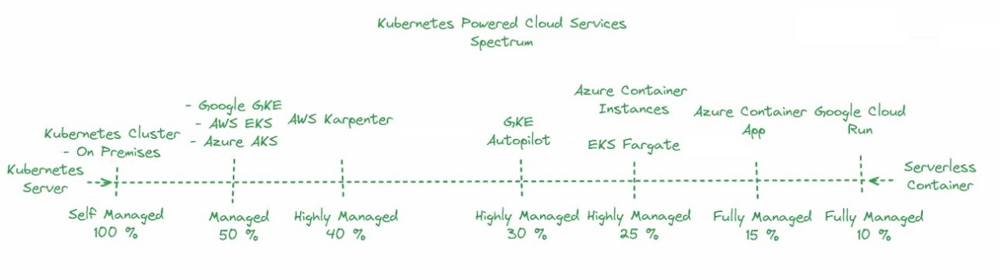

# What are microservices, and how can AI-based microservices be developed?

### What Are Microservices?

- **Definition:** An architectural style where applications are composed of loosely coupled, independently deployable services, each performing a specific function.
- **Key Characteristics:**
  - Independence in development, deployment, and scaling.
  - Modularity, with each service handling specific tasks.
  - Decentralized data management.
  - Communication via lightweight protocols (HTTP/REST, gRPC).
  - Scalability tailored to each service's needs.
  - Continuous delivery for frequent and reliable updates.
- **Advantages:**
  - Flexibility in using different technologies.
  - Scalability focused on individual services.
  - Resilience against failures in one service affecting others.
  - Faster development cycles.
- **Challenges:**
  - Increased complexity in managing multiple services.
  - Ensuring data consistency across services.
  - Sophisticated deployment strategies needed.

### Developing AI-Based Microservices

- **Components:**
  - **Programming Language:** Python for AI development.
  - **Web Framework:** FastAPI for building APIs.
  - **Containerization:** Docker for packaging applications.
  - **Database:** PostgreSQL for data storage.
  - **Event Streaming:** Apache Kafka for real-time data handling.
  - **AI Models:** OpenAI APIs for pre-built AI functionalities.

- **Architecture:**
  - **Client Interaction:** Users engage via web/mobile interfaces.
  - **API Gateway:** Manages and routes API requests.
  - **Microservices:** Independent services for specific AI tasks (e.g., text generation, image synthesis).
  - **Event Streaming:** Kafka handles asynchronous data streams.
  - **Database:** PostgreSQL stores application data.
  - **Deployment:** Kubernetes or serverless platforms (e.g., Azure Container Apps) for scalable, resilient service management.

- **Steps:**
  1. Identify specific AI tasks.
  2. Develop independent microservices using Python and FastAPI.
  3. Containerize services with Docker.
  4. Set up inter-service communication.
  5. Manage data with PostgreSQL.
  6. Handle real-time data with Kafka.
  7. Deploy using Kubernetes or serverless platforms.
  8. Monitor and maintain services.

---
# What is cloud-native computing? What are the differences between cloud and edge computing in AI? Which is more suitable for AI applications, and why? How can both be effectively utilized together?

### What is Cloud-Native Computing?

**Cloud-Native Computing** refers to designing, building, and running applications that fully leverage the advantages of cloud computing. This approach focuses on:
- **Microservices**: Breaking down applications into smaller, independent services that can be developed, deployed, and scaled individually.
- **Containers**: Packaging applications and their dependencies into containers for consistency across different environments.
- **Orchestration**: Using tools like Kubernetes to automate deployment, scaling, and management of containers.
- **Continuous Delivery**: Implementing CI/CD pipelines for frequent updates and iterative improvements.
- **Resilience**: Designing applications to be fault-tolerant and self-healing to handle failures gracefully.

### Differences Between Cloud and Edge Computing in AI

**Cloud Computing**:
- **Location**: Data and processing occur in centralized, data centers or cloud environments.
- **Resources**: Provides vast and scalable computing resources that can be accessed on-demand.
- **Latency**: May have higher latency due to data traveling over the internet to and from the cloud.
- **Cost**: Pay-as-you-go model based on usage; potentially more cost-effective for large-scale or variable workloads.
- **Examples**: Google Cloud AI, AWS SageMaker, Azure Machine Learning.

**Edge Computing**:
- **Location**: Data processing happens closer to the source of data generation, often on local devices or edge servers.
- **Resources**: Utilizes local computing resources, which might be limited compared to cloud data centers.
- **Latency**: Reduced latency since data does not need to travel far, enabling real-time processing.
- **Cost**: May reduce data transfer costs and improve response times; cost depends on the scale and infrastructure.
- **Examples**: IoT devices, local AI inference on edge devices.

### Suitability for AI Applications

- **Cloud Computing**: Suitable for AI applications that require extensive computational resources, large-scale data processing, and flexibility in scaling. Ideal for training complex models, large datasets, and applications with variable workloads.
- **Edge Computing**: Suitable for AI applications needing low latency, real-time processing, or operation in environments with limited or intermittent connectivity. Ideal for scenarios like autonomous vehicles, smart sensors, or real-time data analysis on edge devices.

### Effective Utilization of Both Cloud and Edge Computing

**Hybrid Approach**:
1. **Data Collection and Initial Processing**:
   - Use edge devices to collect and preprocess data locally, reducing the volume of data sent to the cloud and enabling real-time insights.

2. **Model Training and Updates**:
   - Train complex AI models in the cloud, where resources are abundant and scalable. Periodically update models deployed on edge devices.

3. **Inference and Decision Making**:
   - Perform real-time inference and decision-making on edge devices for applications requiring immediate responses. Offload less time-sensitive tasks or complex analytics to the cloud.

4. **Data Synchronization and Integration**:
   - Sync data and results between edge devices and the cloud to ensure a consistent view across systems. Use cloud resources for aggregated analysis and long-term storage.

5. **Cost Optimization**:
   - Optimize costs by leveraging edge computing for real-time needs and the cloud for heavy computation and storage, balancing performance and expenditure.
---
# Which option is more advantageous: Serverless OpenAI API or Cloud-Hosted Open Source LLMs? Why? Additionally, how can both be utilized?

Choosing between Serverless OpenAI APIs and Cloud-Hosted Open Source LLMs like Llama 3 depends on your specific needs, usage patterns, and goals. Here’s a detailed comparison to help you determine which option might be more advantageous for your use case, as well as how both can be effectively utilized together.

### Serverless OpenAI APIs vs. Cloud-Hosted Open Source LLMs

#### **Serverless OpenAI APIs (e.g., OpenAI Chat Completion API)**

**Advantages:**
1. **Economical for Low Volume:**
   - **Pay-as-You-Go:** Costs are based on actual usage. This model is highly cost-effective for applications with sporadic or low-volume requests.
   - **No Infrastructure Management:** The service provider handles all infrastructure management, scaling, and maintenance.

2. **Ease of Use:**
   - **Quick Integration:** Easy to integrate into applications with minimal setup.
   - **Automatic Scaling:** Scales automatically to handle varying traffic loads without requiring manual intervention.

3. **Maintenance-Free:**
   - **No Maintenance Overhead:** Eliminates the need to manage and maintain servers or models.

**Disadvantages:**
1. **Cost for High Volume:**
   - **Expensive at Scale:** Costs can escalate with high-frequency or large-scale usage. The pay-per-use model may become expensive for consistent, high-volume requests.

2. **Limited Customization:**
   - **Vendor Lock-In:** Limited control over the underlying model and infrastructure. Dependence on the provider’s availability, pricing, and policies.

3. **Rate Limits:**
   - **Potential Constraints:** API rate limits may impact performance during peak times.

#### **Cloud-Hosted Open Source LLMs (e.g., Hosting Llama 3)**

**Advantages:**
1. **Economical for High Volume:**
   - **Predictable Costs:** Reserved instances or long-term contracts can lower costs for consistent, high-volume usage.
   - **Bulk Usage:** More cost-effective for applications with consistent and numerous API calls.

2. **Customization and Control:**
   - **Full Control:** Allows for extensive customization of the model and infrastructure.
   - **Integration:** Easier integration with other services and databases within your cloud environment.

3. **Performance Optimization:**
   - **Optimized Resources:** Ability to fine-tune hardware and software settings for specific performance needs.

**Disadvantages:**
1. **Complexity and Maintenance:**
   - **Operational Overhead:** Requires management of infrastructure, including setup, scaling, and updates.
   - **Resource Management:** Need to manage and monitor cloud resources to avoid inefficiencies.

2. **Initial Setup Costs:**
   - **Upfront Investment:** May involve higher initial setup costs and a steeper learning curve.

### When to Choose Each Option

**Serverless OpenAI API:**
- **Best For:**
  - Low-volume or intermittent requests where cost-efficiency is paramount.
  - Rapid deployment and integration with minimal infrastructure management.
  - Scenarios where you want to avoid the complexities of managing servers or models.

**Cloud-Hosted Open Source LLMs (e.g., Llama 3):**
- **Best For:**
  - High-frequency or consistent usage where predictable and lower long-term costs are desired.
  - Applications requiring significant customization or specific performance optimizations.
  - Scenarios where full control over the model and infrastructure is needed.

### Utilizing Both Approaches Together

**Hybrid Strategy:**
1. **Real-Time and Batch Processing:**
   - Use serverless APIs for real-time, low-latency requirements and occasional requests.
   - Utilize cloud-hosted Llama 3 for batch processing, extensive analytics, or high-volume data operations.

2. **Cost Management:**
   - Start with serverless APIs to prototype and test applications at a lower cost.
   - Transition to cloud-hosted solutions for production-scale deployments to optimize cost-effectiveness as usage grows.

3. **Performance and Flexibility:**
   - Leverage serverless APIs for flexible scaling during peak periods or variable demand.
   - Use cloud-hosted Llama 3 to handle predictable workloads and optimize resource utilization.

4. **Resource Optimization:**
   - Combine both approaches to balance cost and performance. For instance, handle immediate user interactions with serverless APIs while using cloud-hosted models for heavy lifting and complex tasks.

**Example Use Case:**
- **E-Commerce Platform:**
  - **Serverless API:** Use OpenAI Chat Completion API for customer support chatbots where interactions are sporadic.
  - **Cloud-Hosted Llama 3:** Host Llama 3 on a cloud provider to analyze customer feedback, generate product recommendations, and perform in-depth data analysis.
---

# What is Nvidia NIM?

**NVIDIA NIM (NVIDIA Inference Microservices)** provides a set of accelerated inference services designed for deploying AI models on NVIDIA GPUs. Here’s a concise summary:

### **Key Features of NVIDIA NIM:**
- **Deployment Flexibility**: Supports deployment on various environments including cloud, data centers, workstations, and PCs.
- **Generative AI Support**: Compatible with NVIDIA AI foundation models and custom models for various AI tasks.
- **Optimized Performance**: Utilizes NVIDIA Triton™ Inference Server, TensorRT™, TensorRT-LLM, and PyTorch to ensure low-latency and high-throughput inference.
- **Customization**: Allows for the deployment of fine-tuned models tailored to specific use cases.
- **Production-Ready**: Built for enterprise use with rigorous validation and robust performance.

### **OS Support:**
- **Official**: Linux (recommended: Ubuntu 20.04 or later).
- **Unofficial**: Other Linux distributions.
- **Not Supported**: Windows, macOS.

### **Deployment Technologies:**
- **Kubernetes and Docker**: NIM integrates seamlessly with Kubernetes and Docker for containerized application management.

For more detailed information, you can explore NVIDIA’s official documentation or API catalog.

---
# Explain kubernetes powered cloud services spectrum.

### What is kubernetes?
Kubernetes is a free tool that helps you run and manage apps that are packed in containers. Containers are like boxes that hold everything an app needs to run. Kubernetes helps you do three main things with these containerized apps:

1. **Deployment**: It helps you set up and start your apps easily.
2. **Scaling**: It helps you add more instances of your app if you need more power or reduce them if you need less.
3. **Management**: It helps you keep an eye on your apps and makes sure they run smoothly.

The best part is that Kubernetes works with any cloud provider (like Google Cloud, AWS, or Azure) or even on your own servers. This means you can use it anywhere without worrying about being locked into one specific cloud service.

### Kubernetes-powered cloud services
Kubernetes-powered cloud services refer to various cloud services that utilize Kubernetes for managing and orchestrating containerized applications. Here's a spectrum of these services

 
1. #### Kubernetes Cluster On-Premises: 100% Self-Managed

    Running a Kubernetes cluster on-premises means all your servers are in your own physical location. You handle everything, from installing and configuring Kubernetes to maintaining and securing the cluster. This gives you full control and customization, but it can be complex, costly, and resource-intensive. For example, in a factory, you would set up and manage Kubernetes on your servers, ensuring everything runs smoothly yourself.
2. #### Google GKE, AWS EKS, Azure AKS: 50% Self-Managed

    Using managed Kubernetes services like Google GKE, AWS EKS, or Azure AKS means the cloud provider takes care of half the management tasks for you.

    - **Cloud-Managed:**
    - The provider handles the Kubernetes control plane, including setup, updates, and scaling.

    - **Self-Managed:**
    - You are responsible for managing the worker nodes, deploying your apps, configuring networking, and maintaining security.

3. #### AWS Karpenter: 40% Self-Managed
    AWS Karpenter is an open-source Kubernetes cluster autoscaler that helps you manage resources more efficiently. When using AWS Karpenter, the management responsibilities are roughly split, with 40% being self-managed and the remaining 60% handled by the service.
4. #### GKE Autopilot: 30% Self-Managed
    GKE Autopilot is a fully managed Kubernetes service from Google Cloud that minimizes your management tasks to around 30%, while Google handles the remaining 70%.
5. #### Azure Container Instances and AWS Fargate: 25% Self-Managed
    Azure Container Instances (ACI) and AWS Fargate are serverless container services that significantly reduce the management burden, leaving you with about 25% of the tasks.
6. #### Azure Container Apps: 15% Self-Managed
    Azure Container Apps is a serverless container service that minimizes your management tasks to around 15%, with the remaining 85% managed by Azure.
7. #### Google Cloud Run: 10% Self-Managed
    Google Cloud Run is a fully managed serverless platform for running containerized applications, with only about 10% of the management tasks left to you.

# Write a note on any two of the following AI stacks: 

1. ### Local AI Microservices Development Stack and Cloud-Native Deployments

    1. **Containers (Docker)**: Package AI microservices with all dependencies for consistent behavior across environments.

    2. **Docker Compose**: Simplify running and managing multi-container applications with a single configuration file.

    3. **Devcontainers**: Use Visual Studio Code or other IDEs to define Docker-based development environments for consistency.

    4. **FastAPI**: Build high-performance APIs for AI models with a simple and fast Python framework.

    5. **SQLModel**: Simplify database interactions and CRUD operations in FastAPI applications with Python.

    6. **PostgreSQL**: Use this reliable open-source RDBMS for data storage and management.

    7. **Dapr**: Provides built-in functionalities for microservices, like state management, service invocation, and pub/sub messaging.

    8. **Kafka**: Handle real-time data streams with this distributed streaming platform, useful for scalable and fault-tolerant data processing.

    9. **Serverless AI Inference APIs**: Utilize serverless APIs like OpenAI's for AI inference without managing infrastructure.

    10. **Open Source LLM Containers (Nvidia NIMs)**: Deploy containerized open-source large language models (LLMs) and fine-tune them as needed.

    11. **Kubernetes Platforms**: Deploy your stack on cloud-native Kubernetes platforms (EKS, GKE, AKS) or on-premises Kubernetes clusters.

    12. **Kubernetes Manifests**: Create YAML files for deploying and managing your Kubernetes applications.

    13. **Dapr Integration**: Simplify Kubernetes deployments with Dapr's deployment templates and runtime.

    14. **Serverless Abstraction (Azure Container Apps)**: Use serverless platforms for automatic scaling and infrastructure management on Kubernetes.

    15. **Cloud-Specific Services**: Consider managed services for databases (e.g., managed PostgreSQL) and streaming platforms (e.g., managed Kafka) to simplify integration and management.

    This stack supports a smooth transition from local development to cloud-native deployments while leveraging modern tools and practices.

2. ### Serverless AI Stack with OpenAI APIs   
    - **Purpose**: Quickly develop AI apps using pre-built AI features without managing infrastructure.
    - **Pros**: Easy setup, quick development, and cost-effective for small projects.
    - **Cons**: Limited control over AI, can be costly with high usage.

    **Components**

    1. **OpenAI Serverless APIs**:
        - **Chat Completion API**: For chat-based AI functions.
        - **Assistant API**: For creating intelligent assistants.

    2. **Microservices Development**:
        - **Python**: Main language for coding microservices.
        - **FastAPI**: Fast framework for building APIs.
        - **Docker**: Packs apps and dependencies into containers.
        - **PostgreSQL**: Stores and manages data.
        - **Apache Kafka**: Handles real-time data streams.

    3. **Serverless Platform**:
        - **Kubernetes-Powered Platforms**: Like Azure Container Apps, for deploying and managing containers without server maintenance.

    **Architecture**

    1. **Client Interaction**:
        - Users interact via web or mobile interfaces.

    2. **API Gateway**:
        - Routes API requests to the right microservices.

    3. **Microservices**:
        - Handles specific tasks like user login, chat processing, data storage, and analytics.

    4. **Event Streaming**:
        - Uses Apache Kafka for real-time data processing and communication between services.

    5. **Database**:
        - Uses PostgreSQL to store important data.

    6. **Serverless Deployment**:
        - Deploys on platforms like Azure Container Apps, which auto-scale and manage resources efficiently without manual server management.